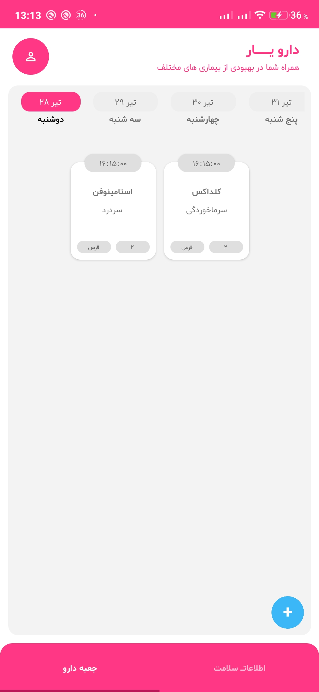
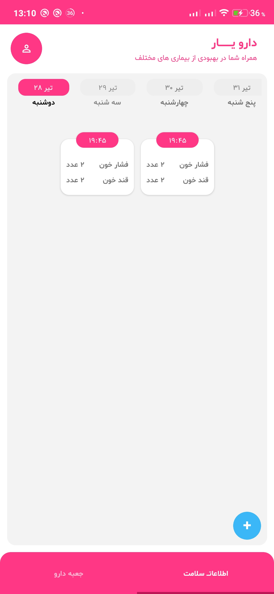
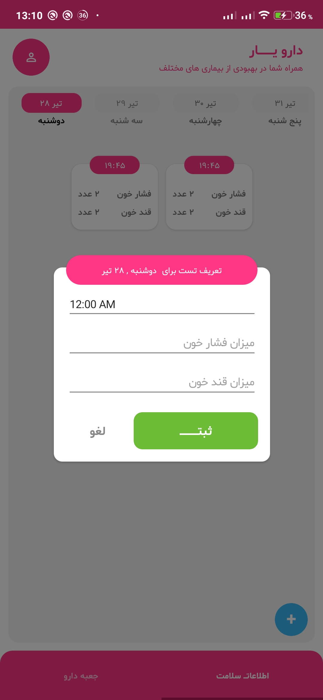
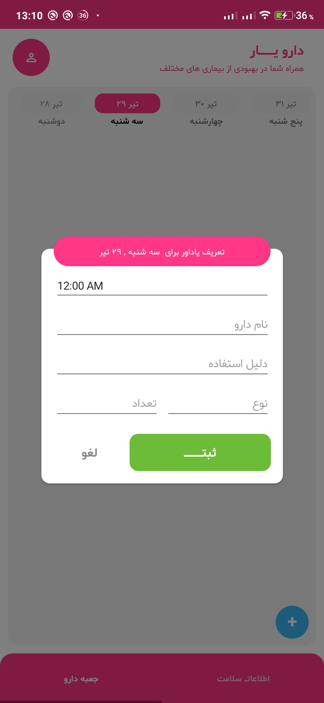
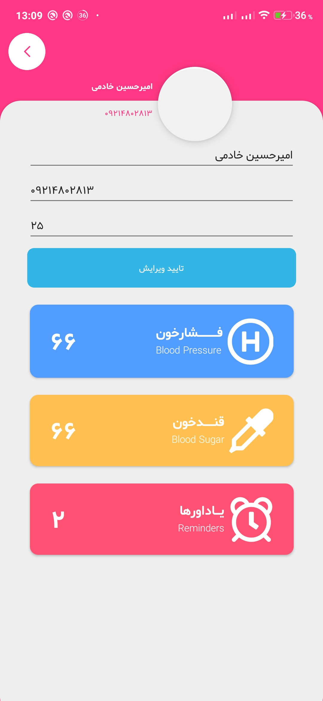
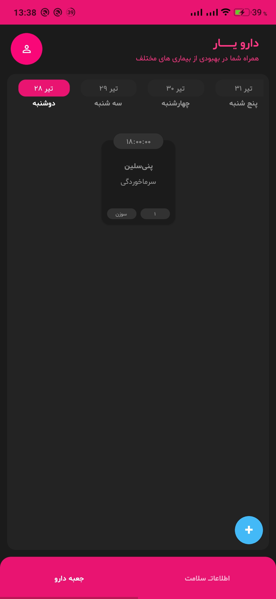
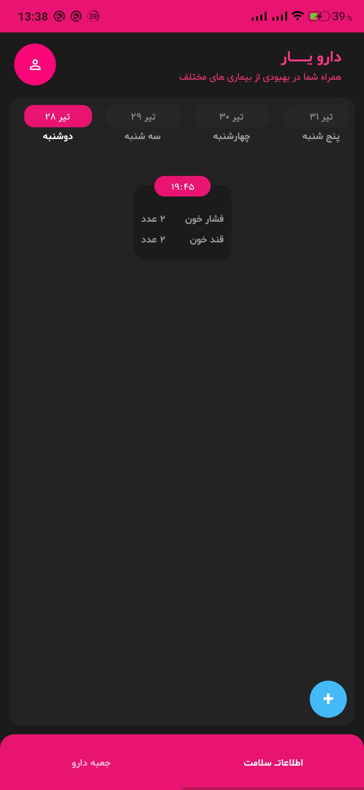
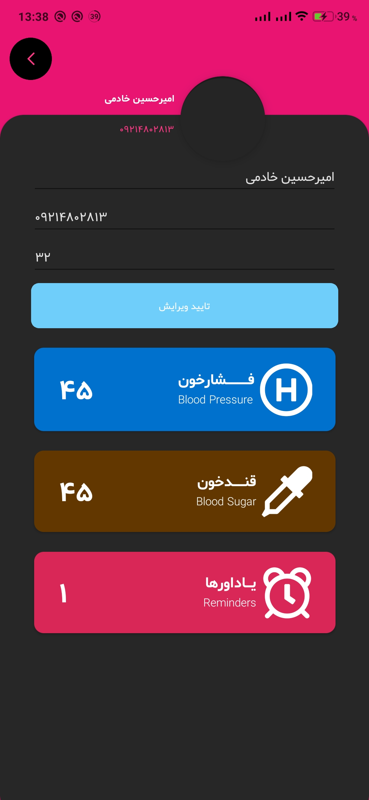

# DarooYar
DarooYar is an application for manage our reminders to use medicine and determine blood sugar and blood pressure

**Packages Used**
|Package|Version|
| ------------------- | :-----------: |
|Xamarin.Forms|5.0.0.2012|
|Xamarin.CommunityToolkit|1.2.0|
|Sharpnado.MaterialFrame|1.1.4|
|PropertyChanged.Fody|3.4.0|
|Prism.Unity.Forms|8.1.97|
|Microsoft.EntityFrameworkCore.Sqlite|5.0.8|
|MD.PersianDateTime.Standard|2.2.0|
|.NET Core|2.0+|
|Tizen|4.0+|

**Platform Support**
|Platform|Version|
| ------------------- | :-----------: |
|iOS|iOS 7+|
|Android|API 15+|

# Screenshots

## LightTheme
  
  

## DarkTheme
  
